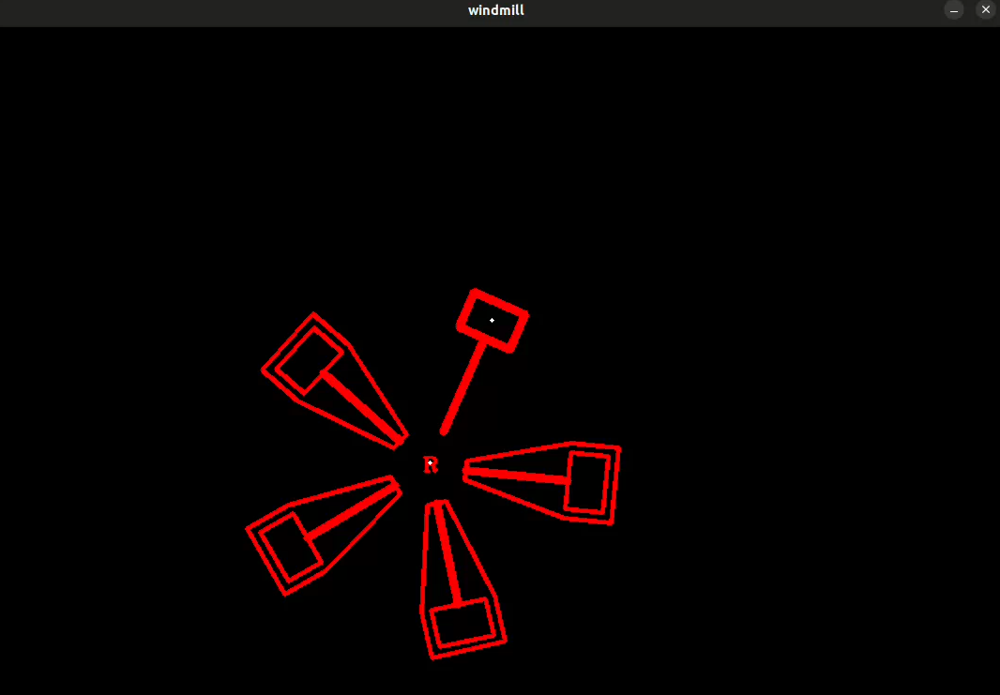

# XJTU-RMV-Task03 能量机关拟合

## 识别 R 标以及锤子并绘制二者中心点

**结果：**

**问题：**

+ 刚拿到手直接跑程序的时候会有机关飘出边界的情况，但是在拟合过程中不会出现该问题，而且发现通过调整 windmill.cpp 中的 center 范围也能解决
  
+ 在使用 ceres 拟合的代码部分使用 params 数组传参数时出现过一个 ***已中止 (核心已转储)***  的报错，询问 gpt 以及搜索该问题的解决办法的结果是在 main 函数中第一句话添加一句代码  `google::InitGoogleLogging(argv[0]);`  同时主函数参数也要加上命令行参数，当时通过这一个改动暂时解决了问题，但是后来对代码进行了一些改动后发现，去除这句代码也没有报错了，因此当时出现该报错具体原因尚未查清
  
+ 所求的四个变量的给定边界优化会对最终拟合时间产生较大影响，但不清楚具体原理，因为经过大量调整发现，太高太低都对时间的减少起副作用，而其规律不明显